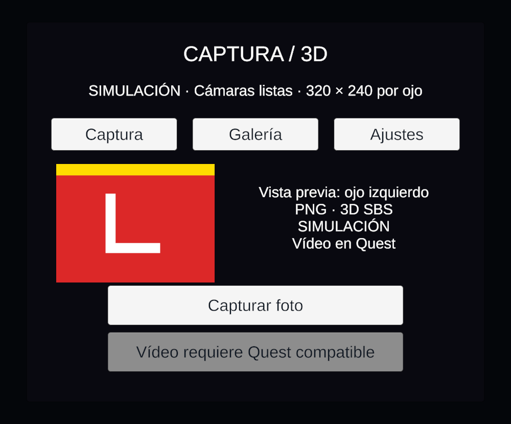
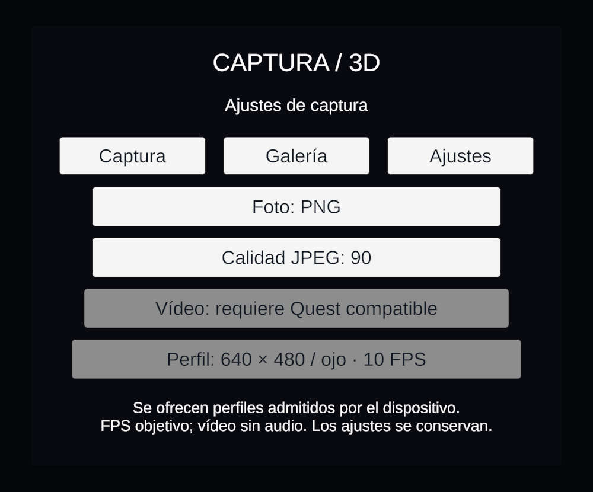
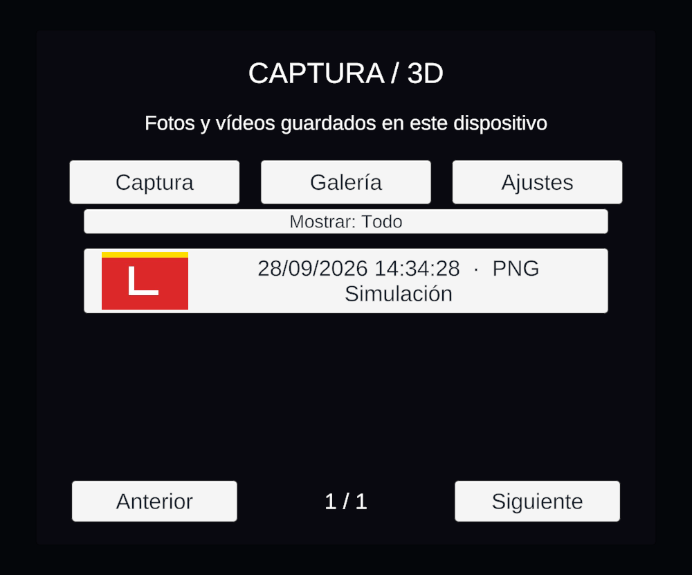
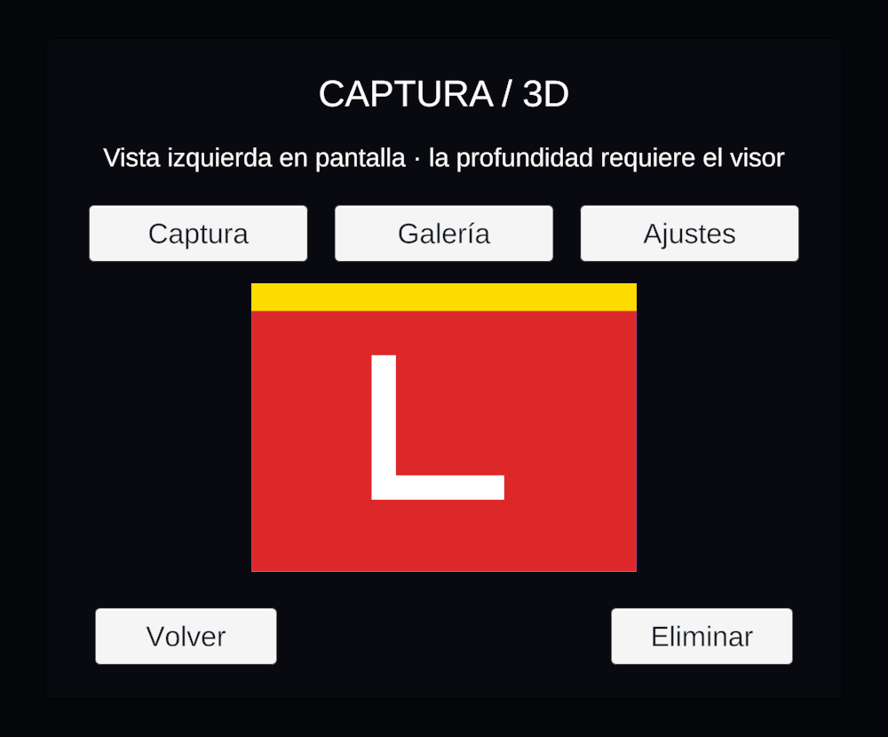

# Resultados de la implementación

Actualizado el 28 de septiembre de 2026. Las imágenes de este directorio proceden de la interfaz real, renderizada en una copia del proyecto; no son diseños propuestos.

## Evidencia local

| Comprobación | Resultado | Alcance |
| --- | --- | --- |
| C# Editor y ramas Android | PASS | Compilación con las referencias Unity locales; no sustituye el enlazado IL2CPP/Gradle |
| Estados y almacenamiento | 32 PASS | Doble pulsación, pares nuevos y tolerancia, doce guardados concurrentes, integridad, disco, cancelación y sesiones de vídeo |
| Java | PASS | Compilación contra SDK Android y conversión YUV planar/intercalada, color, orientación, offsets y padding |
| GPU en Unity | PASS | NVIDIA GeForce RTX 4060, composición SBS, PNG/JPEG, RGBA, instantáneas independientes, miniaturas y selección de ojo |
| Catálogo | PASS | Recuperación de foto, entrada corrupta, rechazo de borrado ajeno y eliminación completa |
| Importación y escenas | PASS | Ambos plugins Android importados; escena principal y recuperación sin componentes perdidos; referencias raíz asignadas |
| Distribución de interfaz | PASS | Captura, Ajustes, Galería y Visor dentro del lienzo; sin errores durante la prueba; inspección visual de los cuatro PNG |
| APK con Unity 6000.3.23f1 | No completado | Compilación nativa ARM64/IL2CPP completada; empaquetado bloqueado por namespaces compartidos de Meta XR 83 con AGP 9 |
| Ajuste de compatibilidad Android | Implementado, sin verificar | Postprocesador de Editor condicionado a Meta XR 83 y AGP 9 o superior; no se ha recompilado tras detener las pruebas por petición del usuario |
| Quest 3 / 3S | Pendiente | Sin validación de cámaras, JNI/MediaCodec, exportación, controlador XR, profundidad o rendimiento sostenido en dispositivo |

Las pruebas gráficas y de distribución registradas se ejecutaron con Unity 6000.3.11f1. Después se detectó que esa instalación había sido sustituida por 6000.3.23f1. La compilación C# y las 32 comprobaciones se repitieron correctamente con las herramientas de 6000.3.23f1, igual que la compilación/prueba Java. El intento de APK se realizó por separado en una copia, con API 35, ARM64 e IL2CPP; terminó sin APK por el bloqueo de empaquetado indicado. Los resultados anteriores no verifican el nuevo postprocesador de compatibilidad.

El postprocesador establece `android.uniquePackageNames=false` en las propiedades Gradle generadas cuando se cumple esa combinación de versiones. La comprobación de clases duplicadas permanece activa. Es una medida temporal para las bibliotecas existentes, no una actualización del SDK. En la copia temporal también se observaron problemas del postprocesado de Meta con rutas largas de Windows; el ajuste de namespaces no corrige esa limitación.

La prueba de distribución configura un par sintético y render 2D para inspeccionar la interfaz sin HMD. No demuestra el ciclo de vida completo en Play, la solicitud del permiso Android, ni la estereoscopia física. El visor de esta prueba muestra exclusivamente la mitad izquierda del archivo SBS.

## Captura

## Ajustes

## Galería

## Visor

## Reproducción de las pruebas

Las instrucciones están en el [README](../../README.md). Los logs completos se conservan localmente en `.utmp/captura/`; los PNG de esta carpeta permiten revisar la distribución sin depender de esos temporales.

Para cerrar la aceptación del TFG falta la matriz T02–T15 del [plan](../../PLAN_IMPLEMENTACION.md): permisos reales, grabaciones de 10/60 segundos, tres sesiones consecutivas, suspensión, reproducción por ojo, exportación y medidas de recursos. La memoria de la aplicación se limita mediante un frame en vuelo; la estabilidad del consumo total aún debe medirse en Quest.
