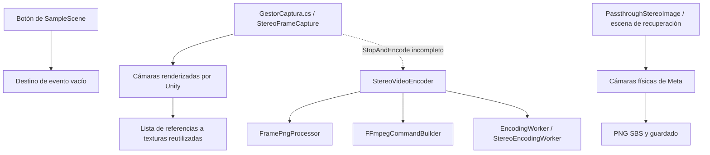
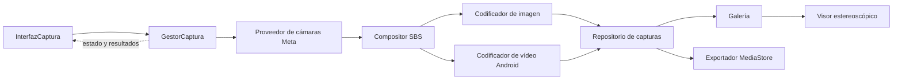

# Plan de implementación de captura estereoscópica para Meta Quest

Fecha del análisis: 21 de septiembre de 2026.

Este proyecto pretende convertir las imágenes de las dos cámaras físicas de Meta Quest 3 y Quest 3S en fotografías y vídeos con percepción de profundidad. La aplicación debe permitir elegir formatos y consultar las capturas en un visor estereoscópico propio. La conclusión del análisis es que primero hay que reparar y unificar la captura: actualmente la interfaz, las cámaras físicas y la codificación pertenecen a rutas parcialmente desconectadas.

El entregable de esta revisión es este plan y la limpieza de scripts prescindibles solicitada. La implementación de la interfaz y las correcciones descritas quedan pendientes. Los hallazgos proceden de lectura de código, escenas, configuración, paquetes locales y del contenido completo de `Assets/Scripts/tfg1.0.docx`; no equivalen a una compilación ni a pruebas en unas Quest.

## 1. Objetivos y alcance

La fuente funcional es el apartado «Objetivos», dentro del capítulo 2 del documento Word. No se modifica el documento original.

| ID | Objetivo del documento | Traducción a funcionalidad | Criterio de aceptación |
| --- | --- | --- | --- |
| O1 | Herramienta gratuita para realizar capturas estereoscópicas | Captura local del entorno real mediante ambas cámaras, utilizable desde el visor | Obtener una foto y un vídeo con vistas izquierda y derecha diferenciadas, sin un servicio de pago obligatorio |
| O2 | Elección de formatos a gusto del usuario | Ajustes de imagen y vídeo que expongan las opciones implementadas y compatibles | Elegir al menos PNG o JPEG para fotos; el vídeo muestra los contenedores/códecs realmente disponibles, conserva la elección y genera un archivo válido |
| O3 | Acceso a las capturas dentro de la aplicación y muestra con estereoscopia | Galería persistente y visor que envíe a cada ojo su vista correspondiente | Cerrar y abrir la aplicación, recuperar una captura y observar profundidad; reproducir, pausar y recorrer un vídeo |
| O4 | Capturas continuas que produzcan vídeo | Iniciar y detener grabación, mostrar duración y guardar el resultado | Una grabación de duración conocida conserva movimiento, orden temporal y duración, sin acumular indefinidamente imágenes en memoria |

El resumen también plantea la visualización en la galería nativa de Quest y en otros reproductores compatibles. Se tratará como un requisito de exportación que necesita pruebas por formato y reproductor, además del visor interno exigido por O3. Guardar un archivo con extensión `.mov` o añadir metadatos no demuestra por sí solo esa compatibilidad.

El documento no fija formatos concretos, resolución, FPS, audio ni duración máxima. Las opciones propuestas aquí son decisiones de implementación que deberán validarse en hardware. Audio, nube, edición multimedia y vídeo espacial multivista específico de Apple quedan fuera de la primera versión. El párrafo del resumen sobre generación procedural de mazmorras no corresponde a los objetivos de captura ni al código analizado; conviene corregir esa incoherencia en la memoria del TFG, sin convertirla en requisito de esta aplicación.

## 2. Funcionamiento actual

### 2.1 Entorno y escena

- Unity declarado: `6000.3.11f1`; Meta XR y MRUK: `83.0.0`; URP: `17.3.0`; OpenXR: `1.16.1`.
- La escena habilitada en `ProjectSettings/EditorBuildSettings.asset` es `Assets/Scenes/SampleScene.unity`.
- La escena contiene rig XR, passthrough, accesos de cámara izquierda y derecha, controladores y un `VR_Menu` con Canvas en espacio mundial y un botón de captura.
- Las cámaras físicas solicitan 1280 × 960 por ojo. La resolución efectiva debe consultarse al iniciarlas; la solicitada no es una garantía.
- El manifiesto incluye `horizonos.permission.HEADSET_CAMERA`, pero el gestor no solicita ese permiso y la escena tiene `requestPassthroughCameraAccessPermissionOnStartup: 0`.
- Existe una escena de recuperación, `Assets/_Recovery/0.unity`, que conserva el prototipo de captura fotográfica.

### 2.2 Ruta principal y ruta alternativa

`Assets/Scripts/GestorCaptura.cs` declara actualmente `StereoFrameCapture`. Su captura recorre `Camera.allCameras`, fuerza renders izquierdo y derecho y compone texturas. No consume los dos componentes `Meta.XR.PassthroughCameraAccess` que ya existen en la escena.



La flecha discontinua indica una intención de implementación, no una ruta operativa. `StopAndEncode` está dentro de una clase privada, contiene errores y no se invoca desde la interfaz.

Analogía: `GestorCaptura` debe ser el director de una orquesta. La cámara, el codificador y la galería pueden ser componentes distintos, pero deben responder a las mismas órdenes y al mismo estado. Pertenecer al flujo del gestor no significa concentrar todo el programa en un único archivo.

## 3. Errores y funciones incompletas

Las líneas indicadas corresponden al código conservado durante esta revisión. P0 bloquea compilación o puesta en marcha; P1 impide un objetivo principal o compromete la integridad de las capturas; P2 afecta robustez, mantenimiento o comunicación del estado. «Confirmado» significa visible en el código o la serialización, no reproducido en hardware.

### 3.1 Bloqueos confirmados

| ID | Prioridad | Evidencia | Efecto y corrección prevista |
| --- | --- | --- | --- |
| B01 | P0 | `GestorCaptura.cs:175–186`: llamada a `StopContinuousCapture()` sin instancia externa y nombres `totalCaptureTime` y `ffmpegExecutablePath` sin declarar | La ruta no compila tal como está escrita. Mover la coordinación de parada al gestor y definir configuración, reloj y dependencias explícitos |
| B02 | P0 | `GestorCaptura.cs:6` declara `StereoFrameCapture` en un archivo llamado `GestorCaptura.cs` | Inconsistencia para un componente MonoBehaviour de Unity. Adoptar `GestorCaptura` como clase raíz, conservar su `.meta` y revisar la serialización de escenas |
| B03 | P0 | `SampleScene.unity:473–475`: destino `fileID: 0`, tipo antiguo `PassthroughStereoSaver`, método `SaveStereoNow` | El botón no tiene receptor. Conectarlo al controlador de interfaz y al gestor; revisar también los nombres antiguos de la escena de recuperación |
| B04 | P0 | `SampleScene.unity:11677`: material nulo; `GestorCaptura.cs:65–66` escribe `_LeftEye`/`_RightEye`; el shader declara `_LeftTex`/`_RightTex` | Primero se produciría una referencia nula; asignar solo un material no resolvería la discrepancia de propiedades. Crear/asignar material correcto y unificar nombres |
| B05 | P1 | `GestorCaptura.cs:39–59`: `Camera.allCameras` y `cam.Render()` | No existe conexión con las texturas de las cámaras físicas que exige el TFG. Sustituir esta fuente por el acceso passthrough de Meta |
| B06 | P1 | `GestorCaptura.cs:12,150,165,193`: dos listas distintas; se llena una lista de pares, se pasa otra lista SBS vacía | El codificador recibiría cero frames aun reparando B01. Establecer una única sesión y un contrato de frames compartido |
| B07 | P1 | `GestorCaptura.cs:26–30,72,165`: se reutilizan las mismas RT; no se copian sus contenidos | No se conservan instantáneas anteriores. Consumir cada frame antes de reutilizar su buffer o mantener copias independientes dentro de una cola acotada |
| B08 | P1 | `FramePngProcessor.cs:28–68`: creación de Texture2D, acceso gráfico y destrucción dentro de `Task.Run` | Operaciones Unity sensibles al hilo se ejecutan fuera del hilo principal. Separar lectura GPU, propiedad de buffers y trabajo CPU/archivos |
| B09 | P1 | `FramePngProcessor.cs:33–36`: destino 2 × 2, copia de un frame completo y posterior lectura CPU | Dimensiones incompatibles y ausencia de una lectura GPU→CPU adecuada. Usar dimensiones reales y readback explícito antes de procesar píxeles |
| B10 | P1 | `GestorCaptura.cs:75–125`: codificación/guardado de foto privados sin llamadas; `StopContinuousCapture` solo detiene | Faltan operaciones públicas completas de foto y finalizar vídeo. Exponer comandos que produzcan resultados observables por la interfaz |
| B11 | P1 | `StereoVideoEncoder.cs:55–66`, `EncodingWorker.cs:14–34`; no hay un backend de vídeo Android integrado en `Assets/Plugins` | La ruta depende de un ejecutable externo sin configuración resuelta. Diseñar y probar un codificador disponible dentro del APK; no dar por funcional el vídeo autónomo |
| B12 | P1 | `GestorCaptura.cs` no gestiona permisos y `SampleScene.unity:8737` desactiva su solicitud automática | No hay flujo explícito para la primera ejecución sin permiso. Solicitar acceso, esperar el resultado real y reflejar denegación o indisponibilidad en la interfaz |

La incompatibilidad de B08/B09 concuerda con las reglas de creación de texturas en el hilo principal y los requisitos de copia de Unity. Referencias: [creación de texturas](https://docs.unity3d.com/6000.0/Documentation/ScriptReference/Texture-allowThreadedTextureCreation.html) y [Graphics.CopyTexture](https://docs.unity.cn/6000.0/Documentation/ScriptReference/Graphics.CopyTexture.html). La versión local del SDK se usará como autoridad para los nombres concretos de las APIs.

### 3.2 Integridad, configuración y funciones ausentes

| ID | Prioridad | Evidencia | Trabajo necesario |
| --- | --- | --- | --- |
| F01 | P1 | No hay galería ni visor propio en los scripts del proyecto | Implementar catálogo persistente, miniaturas y reproducción por ojo; es parte central de O3 |
| F02 | P1 | PNG fijo en el prototipo; comando de vídeo fijo a libx265; salida fija `output_stereo.mov` | Configuración real de formatos, nombres únicos y consulta de capacidades del dispositivo |
| F03 | P1 | `PassthroughStereoImage.cs:129–131` construye iTXt solo con palabra clave y XML | Faltan campos obligatorios de iTXt. Corregir estructura y probarla con un lector; el CRC correcto no hace válido el contenido |
| F04 | P1 | `PassthroughStereoImage.cs:159–191`: campos de profundidad/enfoque y datos vacíos; `PixelOffset` no se usa | No existe una validación de reconocimiento estéreo ni corrección geométrica implementada. Definir SBS izquierda-derecha, conservar datos útiles y probar profundidad/orientación |
| F05 | P1 | No hay emparejamiento por tiempo; `GetTexture()` se convierte directamente a RenderTexture | Evitar combinar imágenes de instantes distintos y aceptar el contrato `Texture` del SDK. Validar timestamps y actualización de ambos ojos |
| F06 | P1 | Lista de frames sin límite, sin limpieza al reiniciar ni liberación de RT en el gestor | Sesiones independientes, límite de memoria, liberación determinista y recuperación al pausar/cerrar |
| F07 | P1 | `StereoVideoEncoder.cs:36–43`: carpeta temporal compartida que se borra al empezar | Dos sesiones pueden destruir datos de otra. Bloquear concurrencia de grabaciones y usar directorios únicos por sesión |
| F08 | P1 | `Time.time` e intervalo sin validar; duración declarada pero sin uso efectivo en el comando | Usar reloj monotónico no escalado, timestamps, FPS positivos y política de frames perdidos. Distinguir vídeo en tiempo real de un futuro timelapse |
| F09 | P1 | Captura/guardado sin resultado estructurado ni cancelación; excepciones convertidas a logs/callbacks | Devolver éxito/error/cancelación; no anunciar «Guardado» antes de terminar y verificar el archivo; limpiar resultados parciales |
| F10 | P2 | `FramePngProcessor.cs:72` usa el índice completado, incluso en `finally`; worker informa siempre `0.5f` | El progreso puede retroceder o parecer exitoso tras un error. Contabilizar trabajo realmente finalizado y publicar eventos en el hilo de interfaz |
| F11 | P2 | `EncodingWorker.cs:14–37`: proceso sin Dispose, sin cancelación/timeout; stdout redirigido sin consumir | Si se conserva un backend de escritorio, drenar salidas, capturar diagnóstico, cancelar y liberar recursos; el bloqueo por stdout depende del volumen de salida |
| F12 | P2 | Guardado Android del prototipo solicita WRITE_EXTERNAL_STORAGE y espera 0,5 s; no hay catálogo interno | Separar permiso de cámara, almacenamiento propio y exportación a MediaStore; esperar callbacks y gestionar fallo/rollback del archivo o URI |
| F13 | P2 | `GestorCaptura.cs:46–56,79–82` restaura valores predeterminados, no los anteriores | Al eliminar la captura de cámaras virtuales desaparece esa manipulación; cualquier RT activa que se modifique debe restaurarse con `try/finally` |
| F14 | P2 | `_texturePropertyName` es `Right` o vacío en cámaras de escena; materiales con `_BaseMap` | Corregir las propiedades de visualización o retirar el enlace si el compositor recibe texturas directamente |

La estructura exigida de iTXt está descrita en la [especificación PNG de W3C](https://www.w3.org/TR/png-3/#11iTXt). Los defectos F03/F04 no demuestran que ningún lector pueda mostrar la imagen; sí invalidan la suposición de que esos metadatos ya resuelven su reproducción estereoscópica.

`BuildAppleStereoHEVCCommand` concatena los ojos con `hstack` y codifica el resultado; la variable `profileStereo` ni siquiera se utiliza. El nombre del método no acredita vídeo multivista de Apple. La opción frame-packing describe una disposición de imágenes; véase la [documentación de x265](https://x265.readthedocs.io/en/master/cli.html#cmdoption-frame-packing). El formato base del proyecto se definirá como SBS y la compatibilidad externa se comprobará por separado.

### 3.3 Riesgos que requieren prueba y no se dan por confirmados

- Rendimiento sostenido, calentamiento, resolución y FPS efectivos en Quest 3 y 3S.
- Disponibilidad del códec de vídeo elegido para el tamaño SBS completo; probar ancho doble, alineaciones y límites de bitrate.
- Funcionamiento de la interacción XR del Canvas: hay EventSystem y raycaster, pero eso no demuestra que el usuario pueda pulsar con los mandos en el dispositivo.
- Comportamiento del passthrough, lectura GPU y renderizado estéreo bajo la configuración gráfica y URP del proyecto.
- Reproducción y reconocimiento 3D en la galería nativa; documentar si requiere selección manual de modo SBS.
- Configuración final del manifiesto fusionado y del APK. `AndroidMinSdkVersion` y `AndroidTargetSdkVersion` figuran como 32; revisar su adecuación al entorno de ejecución y distribución elegido sin actualizar paquetes indiscriminadamente.

## 4. Arquitectura propuesta

Mantener `GestorCaptura.cs` como raíz y convertirlo en el coordinador de estado y sesión. Reutilizar componentes útiles mediante dependencias explícitas. Introducir cada archivo cuando su fase lo necesite, sin crear capas vacías por anticipado.



| Pieza | Responsabilidad | Origen y decisión |
| --- | --- | --- |
| `GestorCaptura` | Comandos, validación, estado, sesión y ciclo de vida | Refactorizar el archivo raíz conservando su GUID |
| `ProveedorCamarasMeta` | Permiso, disponibilidad, resolución y pares con timestamps | Extraer del prototipo fotográfico; dos accesos Meta existentes |
| `CompositorStereo` y material | Componer izquierda y derecha con orientación/tamaño conocidos | Corregir el shader actual; renombrarlo con su `.meta` cuando se migre |
| `ConfiguracionCaptura` | Opciones persistentes y capacidades válidas | Nuevo modelo compartido entre interfaz y servicios |
| `CapturadorFoto` | Obtener una instantánea y codificar PNG/JPEG | Migrar código útil de `PassthroughStereoImage`; separar metadatos y guardado |
| `StereoVideoEncoder` | Contrato de inicio, envío de frame, finalización y cancelación | Rediseñar el actual como fachada al backend elegido |
| Backend Android | Codificar de forma incremental y cerrar el contenedor | Implementar una prueba de MediaCodec/MediaMuxer antes de construir la interfaz de vídeo |
| `RepositorioCapturas` | Guardado seguro, IDs, índice, miniaturas, carga y eliminación | Nuevo servicio local; exportar a galería nativa será una operación diferenciada |
| `InterfazCaptura`, `GaleriaCapturas`, `VisorStereo` | Presentación, navegación y reproducción | Nuevos componentes que consumen servicios y eventos |

Propuesta de comandos del gestor: `Inicializar`, `CapturarFoto`, `IniciarGrabacion`, `DetenerYGuardar`, `CancelarOperacion`. Estas son APIs futuras; hoy no existen con ese contrato. Las operaciones asíncronas deben devolver un resultado o tarea esperable, y permitir cancelación cuando corresponda. Reservar `async void` para adaptadores de eventos que capturen sus excepciones.

Una sesión debe poseer su ID, configuración inmutable, instante inicial, contadores, buffers y salida temporal. El consumidor debe liberar/devolver cada buffer; no podrá reutilizarse mientras haya una lectura GPU o codificación pendiente. Guardar FPS solicitado y medido, tamaño por ojo, disposición SBS y duración efectiva con la captura.

### 4.1 Fuente y codificación

La API local MRUK 83 expone `IsSupported`, `IsPlaying`, `CurrentResolution`, `Timestamp`, `IsUpdatedThisFrame` y `GetTexture()`. Su código advierte que la textura se actualiza en el hilo de renderizado y que un blit bloqueante puede recoger el frame anterior. Diseñar el emparejamiento y la lectura respetando ese orden, y verificarlo con un patrón en movimiento. La [guía oficial de Passthrough Camera API](https://developers.meta.com/horizon/documentation/unity/unity-pca-documentation/) sirve de referencia; no copiar APIs de otra versión sin contrastarlas con el paquete instalado.

Para vídeo autónomo se propone probar primero un puente Android con [MediaCodec](https://developer.android.com/reference/android/media/MediaCodec) y [MediaMuxer](https://developer.android.com/reference/android/media/MediaMuxer). Es una decisión técnica pendiente de validación, no una capacidad ya implementada. La prueba debe resolver alimentación de frames, conversión de color o superficie GPU, timestamps, cierre del contenedor y errores. Evitar que una dependencia de un FFmpeg de escritorio sea obligatoria en Quest.

Si se mantiene FFmpeg para exportaciones de escritorio, aislarlo del backend Android. `FramePngProcessor`, `FFmpegCommandBuilder` y `EncodingWorker` podrán retirarse del flujo de producción después de disponer de un sustituto probado y de eliminar sus referencias. Actualmente sí son dependencias del gestor a través de `StereoVideoEncoder`, por lo que borrarlos ahora dejaría referencias rotas.

### 4.2 Memoria y tiempo

Con 1280 × 960 por ojo y RGBA de 4 bytes, un frame SBS ocupa `2 × 1280 × 960 × 4 = 9.830.400 bytes`, aproximadamente 9,38 MiB. A 30 FPS, conservar un minuto completo sin comprimir requeriría unos 16,48 GiB, sin contar copias adicionales. Son cifras de ejemplo, no medidas del dispositivo. Esto justifica codificar y liberar progresivamente, con una cola pequeña y presupuesto explícito de memoria.

Al saturarse la cola, aplicar una política definida: descartar con contador y conservar la escala temporal, reducir calidad en una sesión posterior o detener con un error recuperable. No fabricar FPS declarando `1 / intervalo` si el hardware no produjo esos frames. El reloj de la grabación y sus timestamps deben seguir representando el tiempo real aunque baje el rendimiento.

## 5. Interfaz funcional

### 5.1 Pantallas y acciones

Reutilizar uGUI y TextMeshPro, ya presentes, con Canvas en espacio mundial. La interfaz se manejará inicialmente con puntero y gatillo de los controladores. Validar el puente de interacción de Meta y conservar una ruta de prueba con ratón en Editor. Las manos pueden añadirse tras completar ese recorrido, sin convertirlas en requisito nuevo.

| Vista | Controles e información | Comportamiento requerido |
| --- | --- | --- |
| Inicio y permisos | Disponibilidad de cámaras, solicitud de permiso, reintentar, acceso a galería | Esperar las dos cámaras con timeout; permitir consultar capturas aunque no haya permiso para nuevas fotos |
| Captura | Selector Foto/Vídeo, capturar o grabar, ajustes, galería, estado | Desactivar acciones incompatibles; mostrar una vista previa útil sin grabar el propio menú |
| Grabando | Indicador textual y visual REC, duración, detener y guardar, descartar | Mantener accesible la parada; bloquear cambio de formato y segunda grabación |
| Procesando | Acción actual, progreso real cuando sea medible, cancelar cuando sea seguro | Diferenciar capturando, finalizando y guardando; no presentar porcentajes inventados |
| Ajustes | Formato de foto, calidad JPEG, perfil de vídeo, resolución, FPS y calidad | Mostrar únicamente combinaciones compatibles y recordar opciones; explicar por qué una opción está deshabilitada |
| Galería | Miniaturas, filtro Foto/Vídeo, fecha, duración, abrir, eliminar | Estado vacío, carga incremental, persistencia y confirmación de eliminación de una captura |
| Visor | Vista por ojo, cerrar; reproducir/pausar, posición y duración para vídeo | Cada ojo ve su mitad; gestionar archivo ausente/corrupto y error de decodificación |
| Resultado y errores | Foto/vídeo guardado, abrir, reintentar o volver | Mostrar el resultado real y una acción recuperable; conservar detalle técnico en logs |

Distribución inicial propuesta:

```text
┌─────────────────────────────────────────────────────┐
│ Captura 3D                 Cámaras listas   Galería  │
│                                                     │
│                   Vista previa                      │
│                                                     │
│ [ Foto | Vídeo ]       PNG · 1280 × 960 por ojo       │
│                                                     │
│             [ Capturar foto ]          [ Ajustes ]   │
│ Última captura: guardada                  [ Abrir ]   │
└─────────────────────────────────────────────────────┘
```

El tamaño y la distancia del panel se ajustarán con pruebas de lectura y pulsación dentro del visor. Usar texto además del color para estados, superficies cómodas de apuntar y mensajes próximos a la acción. Evitar menús que oculten el botón de detener o una vista previa que tape todo el entorno.

### 5.2 Opciones de formato

- Fotos: PNG SBS como salida inicial; JPEG SBS con calidad configurable para cumplir la elección de formato. «SBS» significa que ambas vistas se almacenan una al lado de la otra.
- Vídeo: MP4/H.264 SBS como primer candidato; añadir MP4/HEVC solo después de comprobar codificación y reproducción. No presentar MOV, 10 bits o multivista como disponibles porque haya campos con esos nombres en el código.
- Distinguir formato de archivo/contenedor, códec y disposición estereoscópica. La interfaz puede mostrar un perfil sencillo como «MP4 · H.264 · 3D SBS».
- Antes de cerrar O2, documentar los formatos de vídeo ofrecidos y los que el dispositivo no admite. La primera prueba con un único perfil no completa por sí sola toda la interfaz de elección.
- Resoluciones y FPS: obtener capacidades reales, cruzar las de ambos ojos con las del codificador y validar las combinaciones. Mantener los ajustes durante una grabación y aplicarlos a la siguiente.

### 5.3 Estado único y navegación

Estados del gestor: `Inicializando`, `SinPermiso`, `Listo`, `CapturandoFoto`, `Grabando`, `Finalizando`, `Guardando`, `Suspendido` y `Error`. La pantalla abierta —captura, ajustes, galería o visor— es una dimensión separada: consultar una foto existente no depende del permiso de cámara.

Recorridos normales:

```text
Inicializando → Listo
Listo → CapturandoFoto → Guardando → Listo
Listo → Grabando → Finalizando → Guardando → Listo
Error → Reintentar → Inicializando/Listo, según la causa
```

Cada comando debe validar su transición en el gestor, además de deshabilitar el botón. Así un doble clic o una llamada desde otro componente no puede iniciar dos grabaciones. Al suspender, detener la adquisición y finalizar o descartar de forma controlada; al volver, revalidar permiso/cámaras. El usuario debe conocer si la grabación quedó guardada o interrumpida.

### 5.4 Galería y reproducción estéreo

1. Guardar cada resultado terminado con ID único, tipo, fecha, ruta/URI, tamaño, formato, dimensiones por ojo, orden L/R, duración y miniatura. Mantener un índice versionado y reconstruible para archivos propios.
2. Escribir primero a una salida temporal; cerrar y validar antes de publicar el archivo y añadirlo al catálogo. Una exportación fallida a MediaStore no debe borrar la copia local correcta ni anunciar éxito externo.
3. Cargar miniaturas progresivamente y liberar texturas al cerrar o reciclar celdas; no cargar todos los vídeos/fotos a resolución completa.
4. Para fotos SBS, muestrear UV izquierda `[0, 0.5]` y derecha `[0.5, 1]` en función del ojo XR. Para vídeo, decodificar una textura SBS y emplear el mismo criterio. Probar el shader bajo el modo XR usado en el proyecto.
5. Validar con una imagen de prueba que muestre «L» exclusivamente al ojo izquierdo y «R» al derecho, y después con una escena real que permita comprobar profundidad. Mostrar las dos mitades en un panel plano para ambos ojos no satisface O3.
6. Eliminar desde el catálogo requiere confirmación y sincronización entre archivo, miniatura e índice. Si se publica una copia externa, dejar clara su independencia y registrar su URI cuando se necesite gestionarla.

## 6. Limpieza de scripts

### 6.1 Eliminaciones realizadas en esta revisión

Se han comprobado referencias C# y GUID en `Assets`, `Packages` y `ProjectSettings`, incluidas las dos escenas disponibles. Se han eliminado siete archivos `.cs`, los cinco `.meta` asociados a scripts importados por Unity y el asset de bienvenida con su `.meta`: catorce archivos en total.

| Script eliminado | Motivo | Comprobación |
| --- | --- | --- |
| `Assets/Scripts/Codificador.cs` | Implementación comentada por completo; no aporta un codificador activo | Sin referencias de uso ni referencias a su GUID |
| `Assets/Scripts/NewMonoBehaviourScript.cs` | Plantilla vacía | Sin referencias de uso ni referencias a su GUID |
| `Assets/Scripts/PassthroughStereoVideo.cs` | Duplica captura de PNG; pese a su nombre no graba vídeo; importa `UnityEditor.Media` en código runtime | Sin referencias de uso ni referencias a su GUID; se conserva la versión fotográfica útil |
| `Test.cs` | Texto de prueba que no es C# válido | Fuera de `Assets`, sin papel en el flujo Unity |
| `MetaDataInjert.cs` | Prototipo sin referencias, con declaraciones de bytes incorrectas y parcheo incompleto de contenedores | Fuera de `Assets`; no se reutilizará una inserción manual que pueda invalidar estructura y offsets |
| `Assets/TutorialInfo/Scripts/Readme.cs` | Datos de bienvenida de la plantilla URP | Su único asset dependiente era `Assets/Readme.asset`, eliminado conjuntamente |
| `Assets/TutorialInfo/Scripts/Editor/ReadmeEditor.cs` | Inspector y apertura automática de esa bienvenida | Dependía del Readme de plantilla; ninguna funcionalidad de captura |

Los dos archivos de la raíz no causaban errores de compilación de Unity mientras permanecían fuera de sus carpetas importadas. Su eliminación limpia prototipos ajenos al flujo; no se presenta como una reparación de la compilación principal.

### 6.2 Código conservado y retirada condicionada

| Elemento | Decisión |
| --- | --- |
| `GestorCaptura.cs` | Conservar como raíz y reparar en fase 1 |
| `StereoVideoEncoder.cs` | Conservar: dependencia directa de la raíz; rediseñar contrato/backend |
| `FramePngProcessor.cs`, `FFmpegCommandBuilder.cs`, `EncodingWorker.cs` | Conservar por sus referencias activas; reemplazar o aislar tras validar el backend Android |
| `PassthroughStereoImage.cs` | Conservar temporalmente: fuente útil de captura física y GUID referenciado por la escena de recuperación. Migrar su funcionalidad al flujo del gestor antes de retirarlo |
| Shader compositor | Conservar y corregir nombres/uso; será parte del flujo común de foto y vídeo |
| SDK, rig XR, URP, TextMeshPro, recursos y manifiesto | Son infraestructura; no se determina su necesidad buscando solo llamadas desde el gestor |

La limpieza definitiva del prototipo fotográfico requiere: extraer la funcionalidad, integrar el servicio en el gestor, migrar o retirar deliberadamente su componente/eventos en la escena de recuperación, comprobar GUID y nombres antiguos, y solo entonces eliminar el script y su `.meta`. Conservar esa escena durante esta revisión evita destruir una referencia de trabajo sin sustituto.

Regla para siguientes fases: todo script propio en producción debe ser alcanzable por el flujo del gestor, por el de consulta/reproducción de capturas o por infraestructura necesaria. Comprobar referencias serializadas, eventos, carga por nombre y dependencias de compilación antes de eliminarlo. Al mover o renombrar assets, conservar sus `.meta`.

## 7. Secuencia de implementación

Las fases están ordenadas por dependencia. Las pruebas de cada fase son su puerta de salida; diseñar pantallas encima de una captura que no produce archivos válidos solo oculta los problemas.

### Fase 0 — Inventario y limpieza segura

- [x] Leer las especificaciones y separar objetivos de notas o contenido ajeno.
- [x] Reconstruir dependencias de scripts, escenas, materiales y configuración.
- [x] Eliminar los siete scripts prescindibles y sus dependencias exclusivas descritas.
- [x] Documentar qué debe conservarse hasta disponer de un reemplazo.
- [ ] Verificar importación en Unity y registrar una línea base de errores de compilación.

Salida: inventario limpio y lista reproducible de bloqueos. Esta fase no afirma que el proyecto ya compile.

### Fase 1 — Recuperar el flujo de captura física

Dependencia: fase 0. Objetivos: O1 y base de O4.

- [ ] Reparar B01/B02: clase raíz consistente, comandos accesibles, configuración y estado únicos.
- [ ] Integrar dos cámaras físicas mediante MRUK, permisos, espera con timeout y gestión de suspensión.
- [ ] Sustituir tamaños derivados del render XR por la resolución efectiva de las cámaras.
- [ ] Corregir material, propiedades del shader y referencias del componente en escena.
- [ ] Obtener pares frescos con orientación correcta y trazabilidad de timestamps; admitir el tipo `Texture` del SDK.
- [ ] Conectar provisionalmente el botón existente a la nueva API para probar el recorrido completo.

Salida: importación y compilación Android sin errores; desde la escena principal se obtiene una imagen con dos vistas del entorno físico; denegar permiso produce un estado recuperable.

### Fase 2 — Foto, almacenamiento y configuración

Dependencia: fase 1. Objetivos: O1/O2 y base de O3.

- [ ] Extraer el capturador de foto y separar composición, codificación, metadatos y almacenamiento.
- [ ] Añadir PNG y JPEG con opciones persistentes, nombres únicos y exclusión de capturas concurrentes.
- [ ] Reparar o sustituir los metadatos actuales; guardar descripción estéreo en el catálogo propio.
- [ ] Crear repositorio, índice y miniaturas; escribir de forma segura y devolver resultado verificable.
- [ ] Añadir exportación MediaStore con URI y estado de publicación explícitos.
- [ ] Migrar el prototipo fotográfico y sus referencias de recuperación; retirar el script antiguo cuando la sustitución esté probada.

Salida: capturar dos fotos seguidas no sobrescribe la primera; PNG y JPEG se abren, conservan orden de ojos y aparecen en el catálogo tras reiniciar.

### Fase 3 — Prueba y construcción del vídeo autónomo

Dependencia: fase 1 y almacenamiento de fase 2. Objetivo: O4.

- [ ] Crear una prueba técnica Android de un vídeo corto con frames sintéticos distintos y timestamps conocidos.
- [ ] Elegir backend y perfiles solo tras inspeccionar el archivo y reproducirlo en el dispositivo.
- [ ] Integrar adquisición real, composición SBS y codificación incremental con cola acotada.
- [ ] Implementar parada, vaciado de cola, cierre del contenedor, cancelación y error sin archivo falsamente completo.
- [ ] Medir duración, FPS efectivos, pérdida de frames, memoria y latencia; manejar pérdida de foco.
- [ ] Retirar la ruta PNG/FFmpeg de producción si queda sustituida; mantener una ruta de escritorio solo si existe un uso concreto.

Salida: grabación real de 60 segundos con movimiento, duración coherente y memoria estabilizada; tres sesiones consecutivas independientes. La resolución/FPS inicial se ajusta a lo medido, no a una cifra supuesta.

### Fase 4 — Interfaz de captura y ajustes

Dependencia: fases 1–3. Objetivos: O1/O2/O4.

- [ ] Construir las vistas de la sección 5 reutilizando uGUI/TMP y el rig.
- [ ] Integrar interacción con controladores y validar toda la navegación dentro del visor.
- [ ] Conectar botones y presentación a comandos/eventos del gestor; eliminar listeners antiguos.
- [ ] Implementar estados vacío, ocupado, permiso denegado, error y éxito; mantener visible la parada.
- [ ] Mostrar opciones según capacidades, conservar configuración y evitar dobles operaciones.

Salida: un usuario puede elegir opciones, hacer una foto, iniciar/detener vídeo y entender el resultado sin abrir el Inspector ni consultar logs.

### Fase 5 — Galería y visor estereoscópico

Dependencia: repositorio de fase 2 y vídeo de fase 3. Objetivo: O3.

- [ ] Construir galería paginada, filtros, miniaturas y eliminación confirmada.
- [ ] Crear visor por ojo para imágenes y adaptar el mismo principio a vídeo.
- [ ] Añadir reproducción, pausa, búsqueda temporal, cierre y liberación de recursos.
- [ ] Tratar capturas ausentes, dañadas y códecs no compatibles con mensajes recuperables.
- [ ] Comprobar la reproducción después de reiniciar la app y con permiso de cámara denegado.

Salida: ver profundidad real en foto y vídeo propios dentro de la aplicación; abrir/cerrar diez veces una captura sin acumulación sostenida de memoria.

### Fase 6 — Validación, rendimiento y cierre del TFG

Dependencia: fases anteriores.

- [ ] Ejecutar la matriz de pruebas siguiente en Quest 3 y Quest 3S; si falta un modelo, registrar esa cobertura como pendiente.
- [ ] Probar exportaciones en galería nativa y documentar formatos/modos compatibles.
- [ ] Afinar presupuesto de buffers, calidad y límites de grabación con mediciones.
- [ ] Completar limpieza condicionada y comprobar referencias de escenas/prefabs.
- [ ] Documentar instalación, limitaciones y decisiones; generar resultados y gráficas útiles para el capítulo de pruebas.

Salida: todos los objetivos trazados a pruebas aprobadas y limitaciones explícitas. No se da por completado O3 por el mero hecho de disponer de miniaturas 2D.

## 8. Pruebas de aceptación

| ID | Entorno y caso | Resultado esperado | Objetivos |
| --- | --- | --- | --- |
| T01 | Editor y compilación Android | Cero errores de compilación; escena principal sin componentes propios perdidos ni eventos de captura nulos | Todos |
| T02 | Primera ejecución sin permiso; conceder, denegar y reintentar | Captura bloqueada hasta autorización; respuesta recuperable; galería local accesible | O1/O3 |
| T03 | Cámara no disponible o uno de los ojos no actualiza | Timeout/error explícito, sin captura monoscópica presentada como estéreo | O1/O4 |
| T04 | Par sintético L/R y patrón geométrico | Mitades correctas, sin inversión vertical ni intercambio de ojos; dimensiones exactas | O1/O3 |
| T05 | Foto PNG y JPEG desde la interfaz | Archivo decodificable, configuración aplicada, nombre único, catálogo y miniatura válidos | O1/O2 |
| T06 | Dos pulsaciones rápidas y varias fotos seguidas | Sin corrupción, sobrescritura ni operaciones simultáneas no permitidas | O1 |
| T07 | Vídeo con reloj visible y movimiento durante 10 y 60 s | Movimiento conservado; duración dentro de un 2 % como umbral inicial propuesto; timestamps monótonos y pérdidas contabilizadas | O4 |
| T08 | Tres grabaciones consecutivas y parada inmediata | Sesiones aisladas; cero frames produce resultado explícito; ningún vídeo reutiliza imágenes anteriores | O4 |
| T09 | Suspender durante grabación y durante finalización | Guardado o descarte controlado, recursos liberados y estado coherente al volver | O4 |
| T10 | Poco almacenamiento, fallo de escritura y cancelación | No aparece un éxito falso ni archivo incompleto en la galería; puede reintentarse | O1/O4 |
| T11 | Reiniciar app y abrir galería con muchos elementos | Índice recuperable, miniaturas incrementales, estado vacío y archivo ausente tratados | O3 |
| T12 | Visor: comprobar un ojo cada vez y después ambos | Vista L/R correcta y profundidad perceptible; vídeo con reproducción/pausa/búsqueda | O3 |
| T13 | Abrir/cerrar visor y repetir capturas | Sin crecimiento sostenido de recursos; medir CPU/GPU, memoria, FPS y temperatura durante sesiones largas | Todos |
| T14 | Exportar foto/vídeo a galería nativa | Archivo accesible y reproducción probada; registrar si el modo SBS se elige manualmente | Exportación |
| T15 | Recorrido de usuario solo con controladores | Elegir formato → capturar → abrir galería → reproducir → volver, sin depender del Editor | Todos |

Automatizar pruebas EditMode de validación de configuración, transiciones, timestamps, índice y errores del almacenamiento con proveedores simulados. Usar PlayMode para eventos de UI, dobles comandos y ciclo de vida. La captura física, la comodidad visual y la reproducción en galería nativa requieren pruebas en dispositivo; los mocks no las sustituyen.

Para registrar resultados, usar una ficha con modelo de Quest, versión de Horizon OS, versión de app/SDK, resolución por ojo, perfil, duración, FPS efectivos, frames descartados, memoria máxima y resultado de reproducción. Fijar los límites finales de rendimiento después de la prueba técnica, distinguiendo metas propuestas de medidas obtenidas.

## 9. Comprobaciones de esta entrega y próximo paso

Se ha realizado análisis estático del código propio, lectura del Word, inspección de las dos escenas, búsqueda de referencias por nombre y GUID, y contraste de la API local MRUK 83. Se han comprobado los candidatos antes de eliminarlos y la verificación posterior confirma que los GUID retirados no permanecen referenciados en `Assets`, `Packages` o `ProjectSettings`. Los hashes de ambas escenas permanecen iguales a los registrados antes de la limpieza. También se han comprobado la codificación del Markdown, el cierre de sus bloques de código y `git diff --check`, sin errores de espacios en el diff.

No se ha ejecutado una compilación del proyecto ni pruebas en Quest. Los bloqueos documentados siguen pendientes de reparación. Tampoco se ha evaluado visualmente la maquetación del Word: se ha extraído su texto para analizar requisitos, sin modificar ni volver a generar ese documento.

Había cambios previos en los manifiestos de paquetes y la versión de Unity. Durante la revisión también se observaron cambios de configuración y procesos Unity activos. Esos cambios quedan fuera de la limpieza y deben conservarse; no se atribuyen a correcciones funcionales realizadas en esta entrega.

El siguiente incremento recomendado es la fase 1: lograr que el botón de la escena principal invoque a `GestorCaptura` y obtenga un par de imágenes de las cámaras físicas. Ese recorrido pequeño permite verificar la base antes de ampliar la interfaz.

Mini-reto de comprensión: si cada captura añade a una lista la misma RenderTexture y después la sobrescribe, ¿qué diferencia habrá entre tener cien referencias y tener cien instantáneas independientes?
